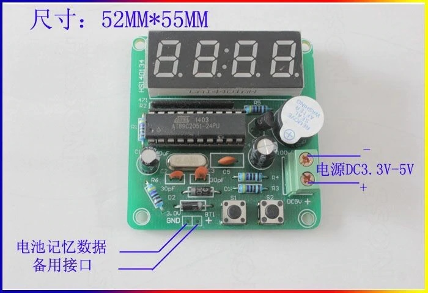
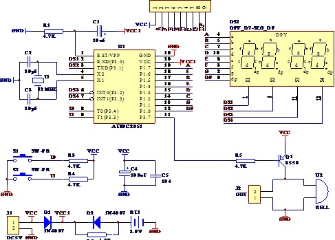
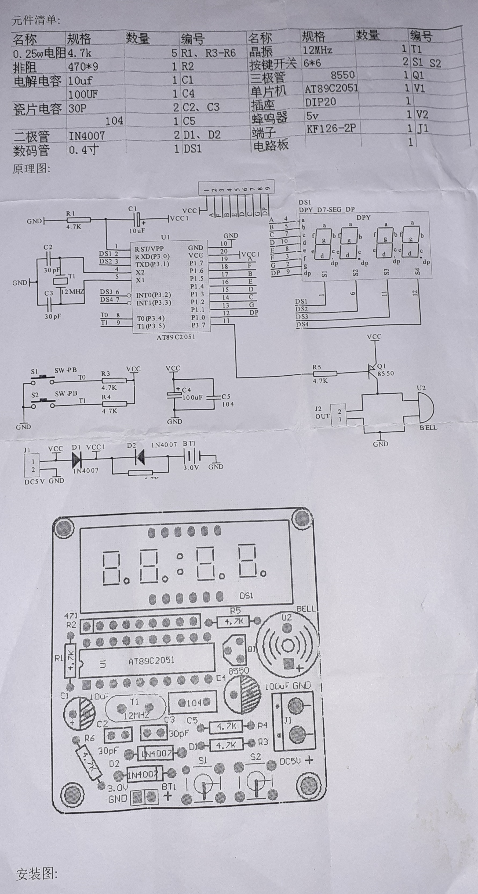
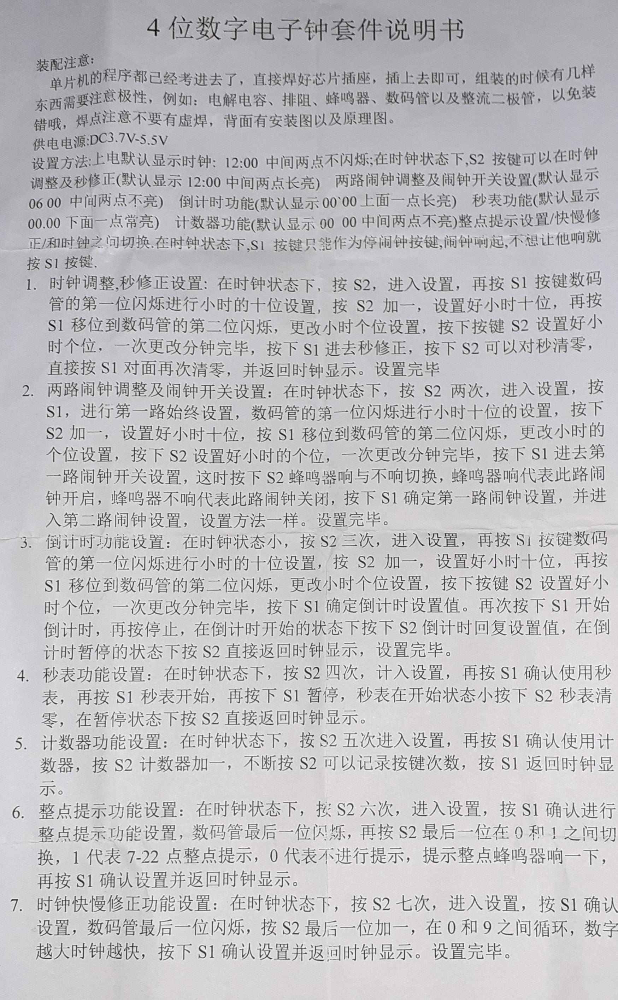

# AT89C2051_4_digit_clock
AT89C2051 4 digit clock instruction manual

4-digit digital electronic clock kit manual assembly note.  
The program of the chip machine has been tested. Just press the chip socket and plug it in. When installing, there are some things that need to pay attention to the polarity, such as: electrolytic capacitors, exclusion, buzzer,  Digital tubes and rectifier diodes, so as not to install wrongly, do not intend to solder joints, there are installation drawings and schematic diagrams on the back of the power supply DC3.7V-5.5V 
setting method
power-on default display clock: 12:00 midnight.  It does not flash. In the clock state, the S2 button can be used to adjust the clock and adjust the seconds (the default display is 12:00, the middle two points are always on) two-way weekly adjustment and two clock switch settings (the default is 06 00 the middle two points are not lit  ) Countdown function (default display is 0000, the top one is always bright) stopwatch function (default display is 00.00 and the bottom one is always bright) counter function (autumn recognition display 00 00 middle two points do not light) the whole point reminder setting / speed correction and clock sentence switching,  In the clock state, the S1 button can only be used as the idle clock button. If you don’t want it, press the S1 button. 
1. Clock adjustment and second correction settings: In the clock state, LONG press S2 to enter the setting, and then press the S1 button  The first digit of the digital tube flashes to set the tens digit of the hour, press S2 to increase by one, set the tens digit of the hour, and then press S1 to shift to the second digit of the digital tube, change the unit digit setting of the hour, and press the button  S2 sets the hour and units digit, after changing the minute at a time, S1 enters the second correction, press S2 to reset the second, directly press the opposite side of S1 to reset it again, and return to the clock display.  Setting is complete 
2. Two-way alarm clock adjustment and clock switch setting; in the clock state, press S2 twice to enter the setting, press S1 to set the first way always, and the first digit of the digital tube flashes for the ten digits of the hour  Set, press S2 to add one, set the tens digit of the hour, press S1 to shift to the second digit flashing of the digital tube, change the units digit setting of the hour, press s2 to set the units digit of the hour, and change the minute at a time.  Press S1 to enter the first channel clock switch setting, then press S2 to switch between the buzzer ringing and not ringing, the buzzer ringing means the clock is on, and the buzzer not ringing means the clock is off, press  Press S1 to determine the first two-clock setting, and enter the second inter-clock setting, the setting method is the same.  Not finished.  
3. Countdown function setting: when the clock is low, press S2 three times to enter the setting, then press S1, the first digit of the digital tube flashes to set the ten digits of the hour, press S2 plus one, set the ten digits of the hour, and then press  Move S1 to the second digit of the nixie tube. Change the hour and units digit setting. Press the button S2 to set the small value. After the change is completed, press S1 to confirm the countdown setting value, and press S1 again to start comparing the hour and units digit.  , And press stop again, press S2 when the countdown is started, the countdown will return to the set value, and when the countdown is counted down, enter the book and press S2 directly to return to the clock display, and the setting is complete.  
4. Stopwatch function setting: in the clock state, press S2 four times to count into the setting, and then press S1 to confirm the use of the second meter, then press S1 to start the stopwatch, and then press S1 to pause, and the stopwatch is in the starting state and press S2  The stopwatch disappears, press S2 in the paused state to directly return to the clock display.  
5.  Counter function setting: In the clock state, press S2 five times to enter the setting, then press S1 to confirm the use of the counter, adjust the S2 counter plus one, keep pressing S2 to record the number of keystrokes, and press S] to return to the clock display.  
6. Hourly reminder function setting: In the clock state, press S2 six times to enter the setting, and S1 confirms to set the hourly reminder function. The last digit of the digital tube flashes, and then press S2. The last digit is between 0 and 1.  Same as switching, 1 means 7-22 o'clock hourly prompt, 0 means no prompt, prompts the hourly buzzer to sound once, then press S1 to confirm the setting and return to the clock display.  
7. Clock speed correction function setting: In the clock state, press S2 seven times to enter the setting, press S1 to confirm the setting, the last digit of the nixie tube flashes, press the last digit of S2 to increase by one, cycle between 0 and 9, the number  The bigger the clock, the faster, press S1 to confirm the setting and return to the clock display. 
